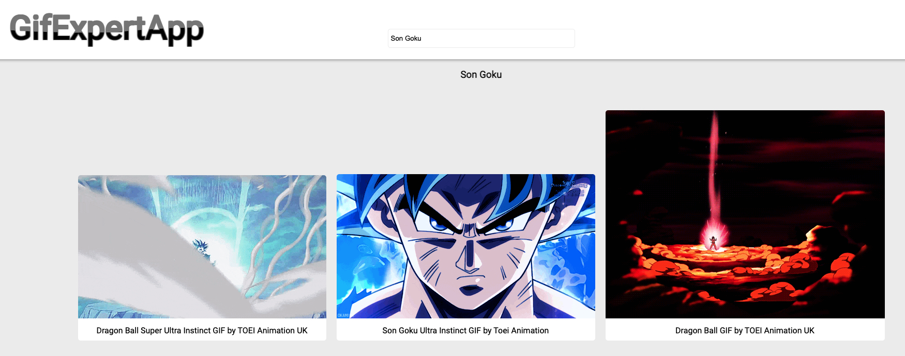

# Aplicación de búsquedas gifs

Este proyecto está creado con Create React App

`npx create-react-app nombreApp`

La API utilizada es: [Giphy](https://developers.giphy.com/) se debe de crear la API key.

## Scripts disponibles

En este proyecto puedes ejecutar los siguientes scprits:

### `npm start`

Ejecuta en modo desarrollo en 

Abrirá [http://localhost:3000](http://localhost:3000) en nuestro navegador.

### `npm test`
Para realizar nuestras pruebas con jest.

### `npm run build`

Para construir nuestra app de producción.
Este comando lo constuirá en la carpeta .\ouldn't customize it when you are ready for it.

## Imágenes de la APP

